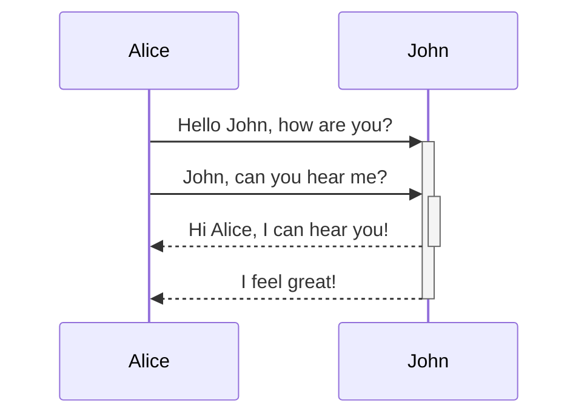
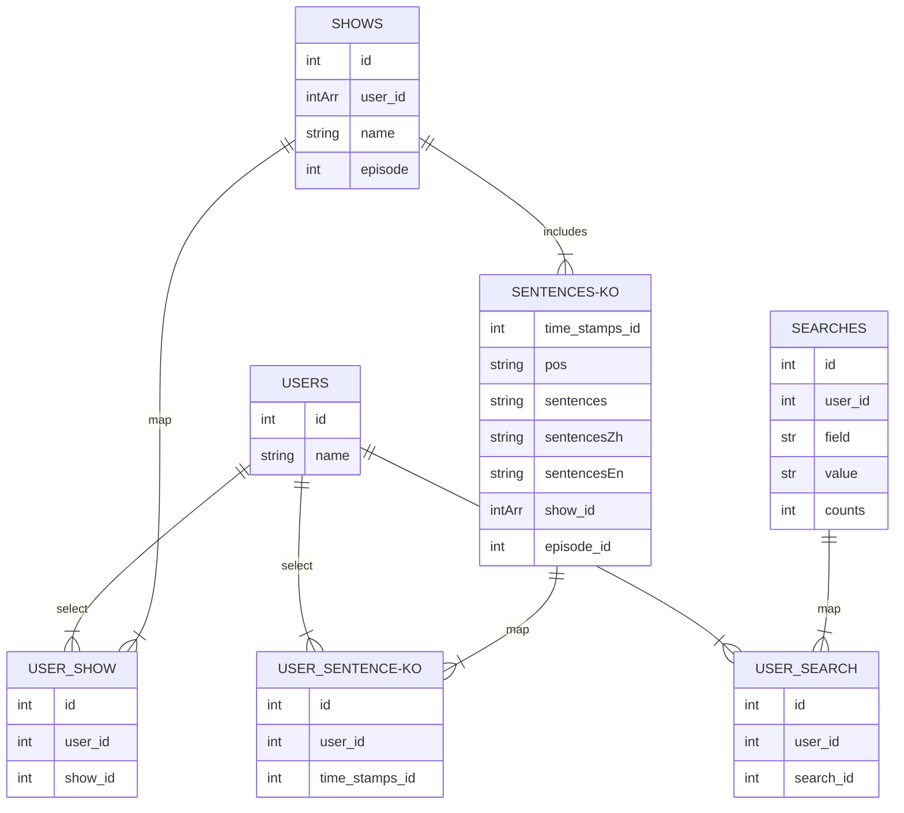

## Hello, world!

Below is an example of markdown in JSX.

  Try and change the background color to tomato

## Entity Relationship Diagrams

```mermaid
sequenceDiagram
    Alice->>+John: Hello John, how are you?
    Alice->>+John: John, can you hear me?
    John-->>-Alice: Hi Alice, I can hear you!
    John-->>-Alice: I feel great!
```

```mermaid
erDiagram
    %% USERS }|--|{ SENTENCES-KO: collect
    USERS ||--|{ USER_SENTENCE-KO: select
    SENTENCES-KO ||--|{ USER_SENTENCE-KO: map
    USERS ||--|{ USER_SHOW: select
    SHOWS ||--|{ USER_SHOW: map
    SHOWS ||--|{ SENTENCES-KO: includes
    USERS ||--|{ USER_SEARCH: record
    SEARCHES ||--|{ USER_SEARCH: map

    USERS {
        int id
        string name
    }
    SENTENCES-KO {
        int time_stamps_id
        string pos
        string sentences
        string sentencesZh
        string sentencesEn
        intArr show_id
        int episode_id
    }
    SHOWS {
        int id
        intArr user_id
        string name
        int episode
    }
    SEARCHES {
        int id
        int user_id
        str field
        str value
        int counts
    }
    USER_SENTENCE-KO {
        int id
        int user_id
        int time_stamps_id
    }
    USER_SEARCH {
        int id
        int user_id
        int search_id
    }
    USER_SHOW {
        int id
        int user_id
        int show_id
    }
```